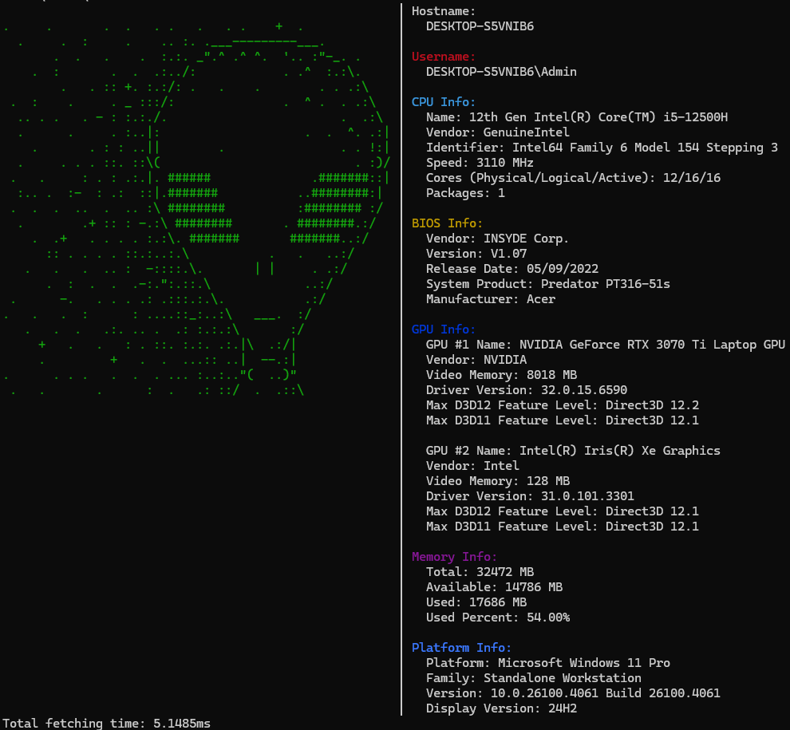

# wfetch 🪟⚙️

**wfetch** is a fast, lightweight [neofetch](https://github.com/dylanaraps/neofetch)-like system info tool built with Go, designed specifically for Windows. It displays ASCII art alongside detailed system information like CPU, memory, GPU, BIOS, OS, resolution, username, and more.

 <!-- Add a screenshot if you have one -->

## Features

- Written entirely in Go with no external CLI frameworks
- Monitor resolution support
- Displays BIOS, GPU, CPU, RAM, OS, hostname, and user info
- Minimal dependencies, fast startup time

##  Dependencies

- [`github.com/fatih/color`](https://github.com/fatih/color) — colorful terminal output
- [`golang.org/x/sys/windows`](https://pkg.go.dev/golang.org/x/sys/windows) — Windows system calls

## Planned Features

- [ ] Configuration via JSON
- [ ] Caching fetching result to improve performance?
- [ ] Theme detection (dark/light)
##  Author

[github.com/fischyn](https://github.com/fischyn)

## License

This project is licensed under the [MIT License](https://opensource.org/licenses/MIT).
